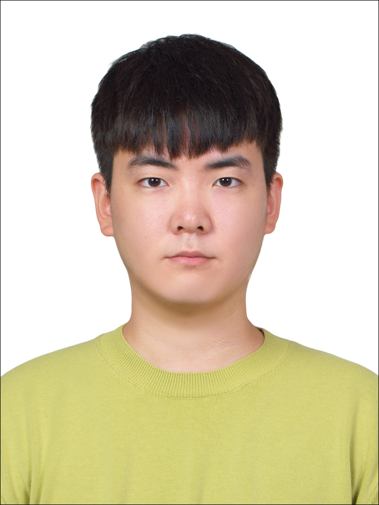
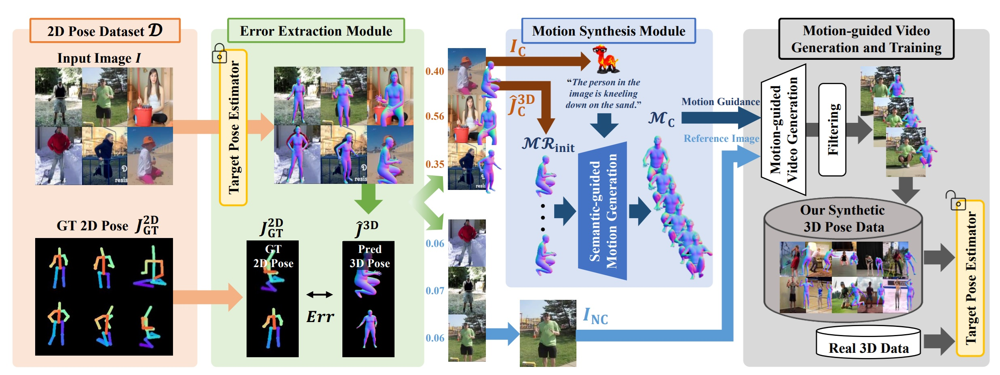
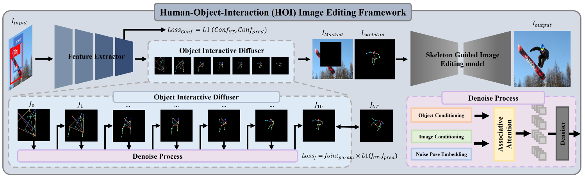
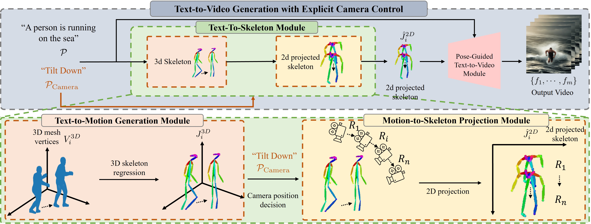
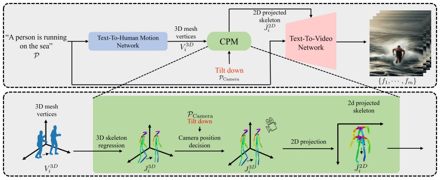

# ChangHee Yang Profile

{: style="float: left; width: 175px; height: 225px; margin-right: 1em; margin-top: 0.5em  "}

### **Researcher**
I am a Computer Vision Researcher at sogang university, Seoul. I will receive a Master`s degree at sogang university Vision & Display Systems Lab(VDSLab).  
I was advised by Prof. Suk-Ju Kang, (TCSVT editor).  
My email: yangchanghee2251@gmail.com & qazw5741@naver.com  

[Google Scholar](https://scholar.google.com/citations?hl=ko&user=KooR_OcAAAAJ) \
[Linkedin](https://www.linkedin.com/in/changheeyang-056083207/) \
[Github](https://github.com/YangChangHee)

 

### Who am I?  
During my M. S degree, I collaborated with the Naver Cloud Video team, and our work was accepted at the main conference of ICCV 2023. Additionally, I participated in an AI grand challenge, where five research labs at Sogang University came together, and we were awarded the KETI director's prize. Furthermore, through collaboration with assistant professor from Pusan National Univerisy, our work got accepted at ICCV 2025, CVPR 2024, WACV 2024 and ICCV workshop 2023. 
Furthermore, I served as a Teacher's Assistant for image processing practice at LG Display. I am currently working as an AI Researcher at LG Electronics' CTO division. I served as a Reivewer at ICCV 2025, NeuRIPS 2025.

### Publications (Accepted)

<!--PoseSyn-->

<b>PoseSyn: Synthesizing Diverse 3D Pose Data from In-the-Wild 2D Data </b>
 
<b>ChangHee Yang</b>*, Hyeonseop Song*, Seokhun Choi*, Seungwoo Lee, Jaechul Kim and Hoseok Do
 
<b>ICCV 2025</b>
 
<b>Project conducted at AI Lab, CTO Division, LG Electronics</b>
 
[<a href="https://arxiv.org/pdf/2503.13025">ICCV</a>] [CODE] [PROJECT PAGE]

 
 
 

<!--Person-In-Place-->

<b> Person in Place: Generating Associative Skeleton-Guidance Maps for Human-Object Interaction Image Editing </b>
 
<b>ChangHee Yang</b>*, Chan Hee Kang*, Kyeongbo Kong*, Hanni Oh and Suk-Ju Kang
 
<b>CVPR 2024</b>
 
<b>Co-Work with Pusan National University</b>
 
[<a href="https://openaccess.thecvf.com/content/CVPR2024/papers/Yang_Person_in_Place_Generating_Associative_Skeleton-Guidance_Maps_for_Human-Object_Interaction_CVPR_2024_paper.pdf">CVPR</a>] [<a href="https://github.com/YangChangHee/CVPR2024_Person-In-Place_RELEASE">CODE</a>] [<a href="https://anonymous.4open.science/w/Person-in-Place_page-67F1/">PROJECT PAGE</a>]

 
 
 

<!--SEFD-->

<b> SEFD: Learning to Distill Complex Pose and Occlusion </b>
 
<b>ChangHee Yang</b>*, Kyeongbo Kong*, SungJun Min*, Dongyoon Wee, Ho-Deok Jang, Geonho Cha and Suk-Ju Kang
 
<b>ICCV 2023</b>
 
<b>Co-Work with Naver Cloud Video Team</b>
 
[<a href="https://openaccess.thecvf.com/content/ICCV2023/papers/Yang_SEFD_Learning_to_Distill_Complex_Pose_and_Occlusion_ICCV_2023_paper.pdf">ICCV</a>] [<a href="https://github.com/YangChangHee/ICCV2023_SEFD_RELEASE">CODE</a>] [<a href="https://yangchanghee.github.io/ICCV2023_SEFD_page/">PROJECT PAGE</a>]

 
 
 

<!--WACV 2024 ICCV workshop 2023-->

<b> Human Motion Aware Text-to-Video Generation with Explicit Camera Control </b>
 
Taehoon Kim*, ChanHee Kang*, JaeHyuk Park*, Daun Jeong*, <b>ChangHee Yang</b>*, Suk-Ju Kang and Kyeongbo Kong
 
<b>WACV 2024</b>
 
<b>Co-Work with Pusan National University</b>
 
[<a href="https://cveu.github.io/2023/papers/32.pdf">ICCV Workshop</a>][<a href="https://github.com/CSJasper/HMTV">Code</a>] [<a href="https://yangchanghee.github.io/HMTV_docs/">PROJECT PAGE</a>]

 
 
 

<!--WACV 2024 ICCV workshop 2023-->

<b> Text-Based Video Generation With Human Motion and Controllable Camera </b>
 
Taehoon Kim*, ChanHee Kang*, JaeHyuk Park*, Daun Jeong*, <b>ChangHee Yang</b>*, Suk-Ju Kang and Kyeongbo Kong
 
<b>ICCV Workshop 2023 (CVEU)</b>
 
<b>Co-Work with Pusan National University</b>
 
[<a href="https://cveu.github.io/2023/papers/32.pdf">ICCV Workshop</a>]
 
<b>Extand Abstract (WACV 2024)</b>

 
 
 

### Submitted
I submitted one paper to ICCV 2025 as the first author, and another paper to TMM as a co-author.

### Project
* Korean Agency for Technology and Standards, “Development of 3D Dynamic Human Surface Shape Measurement protocol,” (Jun. 2023 – Present)  

* Ministry of Public Administration and Security, “A Research on the Development and Demonstration of Smart Road Lighting Platform Technology,” (Mar. 2022 – Jun. 2023)  

* Gachon University, “Development of facial expression change recognition detection method algorithm using neural network-based mixing and mediation strategy,” (Oct. 2020 – Feb. 2022)  

* Ministry of Science and ICT, “AI-based multi-channel cybercrime information collection and profiling system,” (Jun. 2020 – Feb. 2022)  

### Invited
* MODUCON 2023 Poster presentation, "SEFD: Learning to Distill Complex Pose and Occlusion"

### Service
* A Reviewer for computer vision and machine learning conference (ICCV 2025, NeuRIPS 2025)

### Patent
S-J. Kang, C. H. Yang, Complex Pose Extraction Device, KR-Application No. : 10-2023-0111074  
S-J. Kang, C. H. Yang, C. H. Kang, Image generation device using self-generated skeleton guidance-maps, KR-Application No: 10-2023-0167160

### Experience

  <b>AI Research</b>, AI specialist, <b>LG Electronics` CTO Division</b>, seoul, Korea   (Feb. 2024 - present)

  <b>Human Pose Estimation</b>, Co-Worker, <b>Naver Cloud</b>, bundang, Korea   (Jun. 2022 - Jun. 2023)

  <b>Image Processing Practice</b>, Teacher`s Assistant, <b>LG Display</b>, Seoul, Korea   (Aug. 2022, Aug. 2023)

  <b>M.S.</b>,Electronic Engineering, <b>Sogang University</b>, Seoul, Korea   (Mar. 2022 - Feb. 2024)

  <b>Republic of Korea Army</b>, Pocheon, Korea   (May. 2017 - Jan. 2019)

  <b>B.S.</b>, Department of Electronic and Electrical Engineering, <b>Dankook University (DKU)</b>, Jukjeon, Korea (Entrance Scholarship Recipient)   (Mar. 2015 - Feb. 2022)

